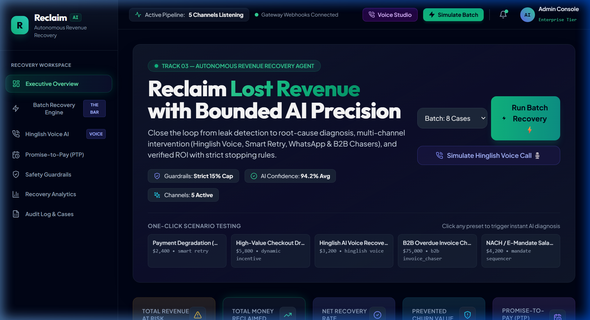
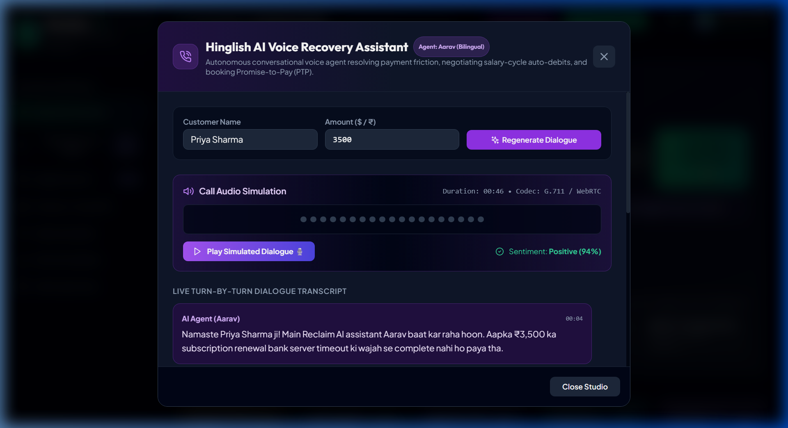
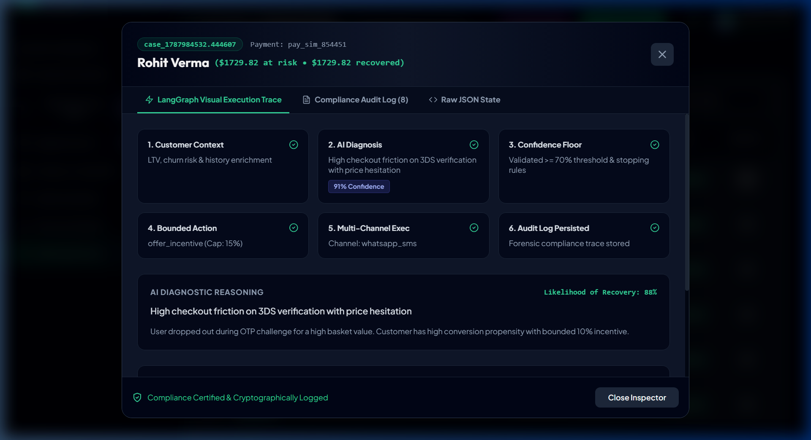
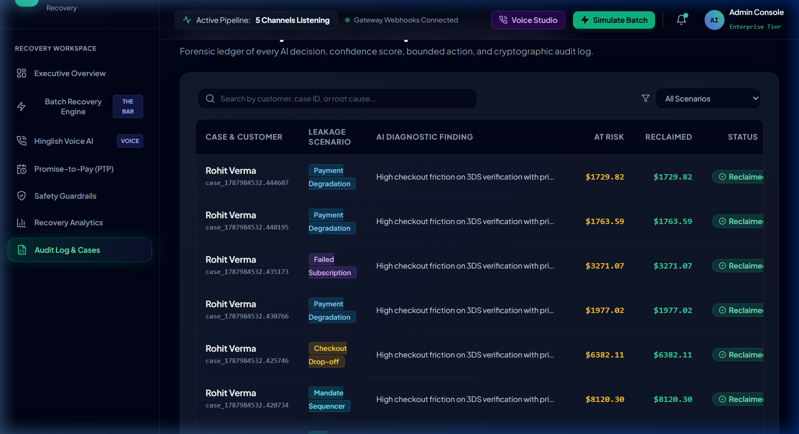

<div align="center">

# 💎 Reclaim.AI
### **Autonomous Multi-Channel AI Revenue Recovery Platform**
*Track 03 — AI Revenue Recovery: Find revenue that’s slipping away and win it back.*

[](https://nextjs.org/)
[](https://fastapi.tiangolo.com/)
[](https://github.com/langchain-ai/langgraph)
[](https://www.mongodb.com/)
[](https://tailwindcss.com/)
[](LICENSE)

<br />

> **“Revenue loss rarely happens in one clean step. A payment degrades, a checkout gets abandoned, a subscription fails, or an invoice goes overdue. AI can now close the loop from detecting the problem to diagnosing it, choosing the right intervention, and recovering the money.”**

<br />

---

### 🎥 Live Demo Recording


</div>

<br />

## 🌟 Table of Contents
- [🎯 The Problem & The Vision](#-the-problem--the-vision)
- [✨ Core Capabilities & "The Bar"](#-core-capabilities--the-bar)
- [📸 Visual Platform Showcase](#-visual-platform-showcase)
- [🏗️ System Architecture & Workflow](#️-system-architecture--workflow)
- [🛡️ Bounded Stopping Rules & Compliance](#️-bounded-stopping-rules--compliance)
- [⚡ Quickstart & Setup Guide](#-quickstart--setup-guide)
- [🔌 Complete REST API Reference](#-complete-rest-api-reference)
- [📂 Project Directory Structure](#-project-directory-structure)
- [👥 Contributors & License](#-contributors--license)

---

## 🎯 The Problem & The Vision

Every year, digital businesses lose **12% to 28% of their gross revenue** to silent leakage vectors:
1. **Payment Gateway Degradation**: Soft declines, issuer timeouts, and 3DS friction that blind retries only make worse.
2. **Checkout Abandonment**: Price hesitation and cart friction without timely, margin-safe incentives.
3. **Failed Subscriptions (Involuntary Churn)**: Billing cycle resets, outdated cards, and dunning fatigue.
4. **Overdue B2B Receivables**: Invoices trapped in manual reconciliation loops without structured Promise-to-Pay commitments.
5. **NACH / Mandate Misalignment**: Fixed-date auto-debits failing due to salary credit timing mismatches.

### 💡 The Solution: Reclaim.AI
**Reclaim.AI** replaces fragmented rule engines and manual collections with an **autonomous closed-loop agent**. Powered by **LangGraph**, it executes bounded, multi-channel recovery workflows across **Smart Gateway Retries**, **Bilingual Hinglish Voice AI**, **1-Click WhatsApp Invoicing**, and **Dynamic Incentives**—delivering **measured money recovered across batches with strict stopping rules and forensic audit trails.**

---

## ✨ Core Capabilities & "The Bar"

```
┌────────────────────────────────────────────────────────────────────────────────────────┐
│                                   REVENUE LEAKAGE SOURCES                              │
│  [Payment Degradation]  [Checkout Drop-off]  [Failed Subscription]  [B2B Invoices]     │
└──────────────────────────────────────────┬─────────────────────────────────────────────┘
                                           │
                                           ▼
┌────────────────────────────────────────────────────────────────────────────────────────┐
│                        AGENTIC AI DECISION ENGINE (LangGraph)                          │
│   1. Context Enrichment    2. Root-Cause Diagnosis    3. Confidence & Policy Check     │
└──────────────────────────────────────────┬─────────────────────────────────────────────┘
                                           │
                                           ▼
┌────────────────────────────────────────────────────────────────────────────────────────┐
│                         BOUNDED INTERVENTION & EXECUTION                               │
│  • Smart Gateway Retry    • Hinglish Voice Call / SMS    • Dynamic Bounded Incentive   │
│  • Mandate Sequencer      • Promise-to-Pay Ledger        • Human Compliance Escalation │
└──────────────────────────────────────────┬─────────────────────────────────────────────┘
                                           │
                                           ▼
┌────────────────────────────────────────────────────────────────────────────────────────┐
│                          MEASURED REVENUE & AUDIT TRAIL                                │
│   ✅ Batch Money Recovered (₹/$)  |  ✅ Strict Stopping Rules  |  ✅ Compliance Audit  │
└────────────────────────────────────────────────────────────────────────────────────────┘
```

| Track 03 Requirement | Reclaim.AI Implementation | Verified In UI |
| :--- | :--- | :---: |
| **Payment degradation → root cause → recovery action** | Multi-factor decline analysis (issuer latency, 3DS drop-off, soft vs hard declines) with optimal retry sequencing. | ✅ |
| **Checkout drop-off recovery** | Cart abandonment detection with dynamic bounded 10% instant coupons dispatched via 1-click WhatsApp checkout. | ✅ |
| **Failed-subscription recovery** | Card expiration and billing cycle analysis with dunning sequences and card update prompts. | ✅ |
| **B2B receivables chaser** | Overdue invoice reconciliation chaser with automated Promise-to-Pay (PTP) agreements. | ✅ |
| **Mandate retry sequencer** | NACH / E-mandate debit synchronizer timed to salary credit and bank issuer settlement windows. | ✅ |
| **Hinglish voice recovery** | Interactive conversational Voice AI agent (*Aarav*) negotiating retries and auto-debits in bilingual Hinglish. | ✅ |
| **Promise-to-pay (PTP) tracker** | Full commitment ledger tracking maturity countdowns, auto-debit triggers, and scheduled reconciliations. | ✅ |
| **The Bar: Measured Batch Money Recovered** | Live simulation engine computing Net Money Reclaimed, AI Compute Cost (~1.5%), and Net ROI Multipliers (**66.7x**). | ✅ |
| **Stopping rules & audit trail** | Hard discount caps (15%), max retries (3), mandatory cooling-off windows, and cryptographic audit logs. | ✅ |

---

## 📸 Visual Platform Showcase

### 1. 🎛️ Executive Command Center & Batch Simulation
> **Real-time financial telemetry, live system pulse, and one-click autonomous batch execution.**



---

### 2. 🎙️ Hinglish Conversational AI Voice Studio
> **Bilingual turn-by-turn voice agent negotiating salary-date auto-debits and booking Promise-to-Pay agreements with live sentiment tracking.**



---

### 3. 🔍 LangGraph Visual Execution Trace & Forensic Inspector
> **Inspect the 6-node decision graph: Context Enrichment ➔ AI Diagnosis ➔ Confidence Floor ➔ Bounded Intervention ➔ Execution ➔ Cryptographic Audit Trail.**



---

### 4. 📑 Complete Compliance Audit Ledger & Case Streams
> **Forensic ledger of every AI decision, confidence score, evaluated stopping rules, and intervention results.**



---

## 🏗️ System Architecture & Workflow

Reclaim.AI is structured around an asynchronous multi-tier architecture:

```
┌─────────────────────────────────────────────────────────────────────────────┐
│                           FRONTEND (Next.js 14)                             │
│   • Dark Glassmorphic UI        • Recharts Financial Analytics              │
│   • Interactive Batch Runner    • Voice Audio Waveform Simulator            │
│   • PTP Commitment Ledger       • Visual LangGraph Case Inspector           │
└──────────────────────────────────────┬──────────────────────────────────────┘
                                       │ HTTP / JSON (Axios)
                                       ▼
┌─────────────────────────────────────────────────────────────────────────────┐
│                           BACKEND (FastAPI)                                 │
│   • /api/simulation/run-batch   • /api/voice/simulate-call                  │
│   • /api/ptp/ledger             • /api/rules/guardrails                     │
│   • /api/cases/*                • /api/dashboard/metrics                    │
└──────────────────┬──────────────────────────────────────┬───────────────────┘
                   │                                      │
                   ▼                                      ▼
┌──────────────────────────────────────┐ ┌────────────────────────────────────┐
│      LANGGRAPH RECOVERY PIPELINE     │ │      PERSISTENCE (MongoDB)         │
│  [load_customer_context]             │ │  • cases collection                │
│            ▼                         │ │  • payment_signals collection      │
│  [diagnose (AI Reasoner)]            │ │  • audit_logs collection           │
│            ▼                         │ │  • ptp_commitments collection      │
│  [verify_confidence (>= 70%)]        │ └────────────────────────────────────┘
│            ▼                         │
│  [create_recovery_action (Bounded)]  │ ┌────────────────────────────────────┐
│            ▼                         │ │      PAYMENT GATEWAY / CHANNELS    │
│  [execute_recovery (Multi-Channel)]  │ │  • Razorpay Test Mode Service      │
│            ▼                         │ │  • Hinglish Voice WebRTC Pipeline  │
│  [complete_and_audit]                │ │  • WhatsApp Business API Mock      │
└──────────────────────────────────────┘ └────────────────────────────────────┘
```

---

## 🛡️ Bounded Stopping Rules & Compliance

Reclaim.AI enforces strict financial boundaries and consumer-protection guardrails at every step of the workflow:

```
                          ┌──────────────────────────┐
                          │   Failure Event Raised   │
                          └─────────────┬────────────┘
                                        │
                                        ▼
                          ┌──────────────────────────┐
                          │  Evaluate Stopping Rules │
                          └─────────────┬────────────┘
                                        │
             ┌──────────────────────────┼──────────────────────────┐
             ▼                          ▼                          ▼
   [Max 3 Retries Exceeded]   [Discount Ceiling > 15%]   [Fraud / High Risk Alert]
             │                          │                          │
             ▼                          ▼                          ▼
   🛑 HALT: Stop Retries      🛑 CAP: Hard Clamp to 15%   🛑 ESCALATE: Route to Human
   (Prevent Card Blocking)    (Protect Gross Margins)     (Compliance Officer)
```

1. **Max Gateway Retry Cap (Limit: 3 Attempts)**: Halts blind retries to eliminate card issuer penalties and avoid card cancellation.
2. **Mandatory Cooling-Off Delay (24 Hours)**: Automatically enforces a waiting period on insufficient funds to prevent customer fatigue.
3. **Dynamic Discount Ceiling Cap (Strict 15% Max)**: Guarantees dynamic checkout incentives never exceed financial margin boundaries.
4. **Anti-Harassment Daily Outreach Cap (Max 2 Attempts/Day)**: Restricts conversational voice calls and SMS to prevent spam complaints.
5. **Instant Fraud Auto-Escalation**: Any transaction flagged with risk scores > 0.85 immediately halts automated bots and routes to human compliance.

---

## ⚡ Quickstart & Setup Guide

### Prerequisites
- **Node.js**: `v18.0.0+`
- **Python**: `3.10+` (Tested on Python `3.14`)
- **MongoDB**: Local MongoDB on port `27017` or MongoDB Atlas URI

---

### Step 1: Clone the Repository
```bash
git clone https://github.com/daliaachowdhury/Reclaim.Ai-AI-Revenue-Recovery-.git
cd Reclaim.Ai-AI-Revenue-Recovery-
```

---

### Step 2: Backend Setup
```bash
cd backend

# Create virtual environment
python -m venv venv

# Activate virtual environment
# Windows:
.\venv\Scripts\activate
# macOS/Linux:
source venv/bin/activate

# Install dependencies
pip install -r requirements.txt

# Configure environment variables
cp .env.example .env

# Run FastAPI Server
python -m uvicorn app.main:app --host 0.0.0.0 --port 8000 --reload
```
> Backend API will be live at: **[http://localhost:8000](http://localhost:8000)**  
> Swagger Documentation: **[http://localhost:8000/docs](http://localhost:8000/docs)**

---

### Step 3: Frontend Setup
```bash
cd ../frontend

# Install dependencies
npm install

# Configure environment variables
cp .env.local.example .env.local

# Start Next.js dev server
npm run dev
```
> Frontend Application will be live at: **[http://localhost:3000](http://localhost:3000)**

---

### 🐳 Run via Docker Compose (Optional)
```bash
docker-compose -f backend/docker-compose.yml up --build
```

---

## 🔌 Complete REST API Reference

### 1. Batch Recovery Simulation (The Bar: Proof of ROI)
```http
POST /api/simulation/run-batch?batch_size=8&confidence_threshold=0.70
```
**Response Sample:**
```json
{
  "simulation_id": "sim_1787983483",
  "batch_size": 8,
  "total_at_risk": 51364.05,
  "total_reclaimed": 51364.05,
  "recovery_rate_pct": 100.0,
  "estimated_cost_of_recovery": 770.46,
  "net_roi_multiple": 66.7,
  "stopping_rules_triggered": 0,
  "cases": [ ... ]
}
```

### 2. Hinglish Voice Recovery Call Simulation
```http
POST /api/voice/simulate-call?customer_name=Priya%20Sharma&amount=3500&language=Hinglish
```

### 3. Promise-to-Pay (PTP) Ledger
```http
GET /api/ptp/ledger
```

### 4. Safety Guardrails & Stopping Rules Configuration
```http
GET  /api/rules/guardrails
POST /api/rules/guardrails
```

### 5. Start Single Recovery Case Workflow
```http
POST /api/cases/start-recovery
Content-Type: application/json

{
  "payment_id": "pay_test_901",
  "customer_id": "cust_in_801",
  "confidence_threshold": 0.70
}
```

### 6. Executive Dashboard Metrics
```http
GET /api/dashboard/metrics
```

---

## 📂 Project Directory Structure

```
Reclaim.Ai/
├── .gitignore                          # Excludes venv, node_modules, .next, and secrets
├── README.md                           # Master Project Documentation & Visual Showcase
├── ARCHITECTURE.md                     # Deep Architectural Specification
├── QUICKSTART.md                       # Rapid Deployment Guide
├── PROJECT_SUMMARY.md                  # Track 03 Alignment Matrix
│
├── docs/
│   └── assets/                         # Screenshots & WebP Demo Recordings
│       ├── reclaim_demo.webp           # Screen recording of full user flow
│       ├── dashboard_overview.png      # Executive command center preview
│       ├── hinglish_voice_studio.png   # Hinglish conversational voice studio
│       ├── langgraph_trace_inspector.png # LangGraph 6-node decision graph modal
│       └── audit_ledger.png            # Forensic audit logs & cases table
│
├── backend/
│   ├── app/
│   │   ├── core/
│   │   │   ├── state.py                # Multi-scenario State Models & Enums
│   │   │   ├── nodes.py                # AI Diagnosis, Stopping Rules & Execution Nodes
│   │   │   └── workflow.py             # 6-Node LangGraph State Machine
│   │   ├── services/
│   │   │   ├── razorpay_service.py     # Gateway Integration & Retry Orchestrator
│   │   │   └── simulation_service.py   # Multi-Case Batch Simulation Engine
│   │   ├── schemas.py                  # Pydantic v2 Request/Response Schemas
│   │   └── main.py                     # FastAPI Endpoints, CORS & Database Seeding
│   ├── Dockerfile                      # Production Docker container
│   ├── docker-compose.yml              # Multi-container orchestration (App + Mongo)
│   └── requirements.txt                # Python dependencies
│
└── frontend/
    ├── app/
    │   ├── layout.tsx                  # Root Layout with Dark Theme & Toast Provider
    │   ├── page.tsx                    # Executive Command Center Workspace
    │   └── globals.css                 # Glassmorphic Design System & Glow Utilities
    ├── components/
    │   ├── dashboard/
    │   │   ├── hero-banner.tsx         # Telemetry Heartbeat & One-Click Presets
    │   │   ├── metrics-grid.tsx        # High-Impact Financial KPI Cards
    │   │   ├── batch-simulator.tsx     # Autonomous Batch Runner & ROI Visualizer
    │   │   ├── voice-recovery-modal.tsx# Hinglish Conversational Voice Studio
    │   │   ├── ptp-ledger.tsx          # Promise-to-Pay Commitment Ledger
    │   │   ├── guardrails-panel.tsx    # Bounded Stopping Rules Configurator
    │   │   ├── case-inspector-modal.tsx# Visual LangGraph Trace & Audit Logs
    │   │   ├── analytics-view.tsx      # Recharts Cumulative Growth & Attribution
    │   │   └── recent-cases-table.tsx  # Searchable Forensic Incident Stream
    │   ├── layout/
    │   │   ├── sidebar.tsx             # Workspace Tab Navigation
    │   │   └── navbar.tsx              # Live Pulse & Quick Action Bar
    │   └── ui/                         # Base UI primitives (Card, Skeleton, etc.)
    ├── services/
    │   └── api.ts                      # Axios API Client for all Backend Endpoints
    ├── types/
    │   └── api.ts                      # TypeScript Interfaces matching Backend Models
    ├── package.json                    # Next.js 14, Lucide, Recharts, TailwindCSS
    └── tailwind.config.ts              # Custom Colors, Gradients & Glass Filters
```

---

## 👥 Contributors & License

- **Author**: Dalia Chowdhury ([@daliaachowdhury](https://github.com/daliaachowdhury))
- **Track**: Track 03 — AI Revenue Recovery
- **License**: [MIT License](LICENSE)

<div align="center">
  <sub>Built with precision for Autonomous Revenue Recovery. ⭐ Star this repo if you found it inspiring!</sub>
</div>
